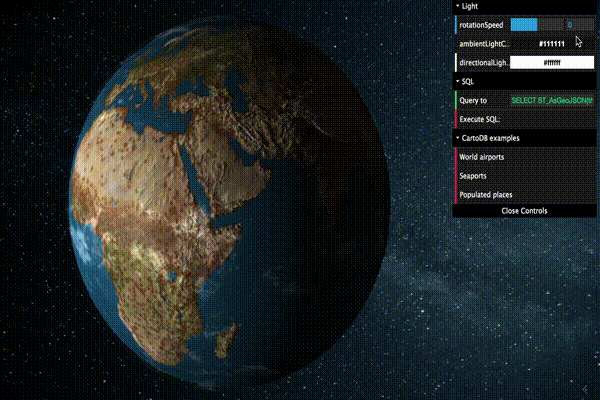

# carto3Db_globe

## Description
**carto3Db_globe** is an app where you can watch your CartoDB *points* dataset in a 3D globe.

You can set your own query (points dataset) in the SQL section->*Query* and clicking on *Execute SQL*.

## Web
http://xatpy.github.io/PlayingWithThree.JS/

### SQL query example
> **SELECT ST_AsGeoJSON(the_geom) FROM {{table}}**

Default examples:
> select ST_AsGeoJSON(the_geom) from populated_places

> select ST_AsGeoJSON(the_geom) from ne_10m_ports

> select ST_AsGeoJSON(the_geom) from populated_places

## Image

